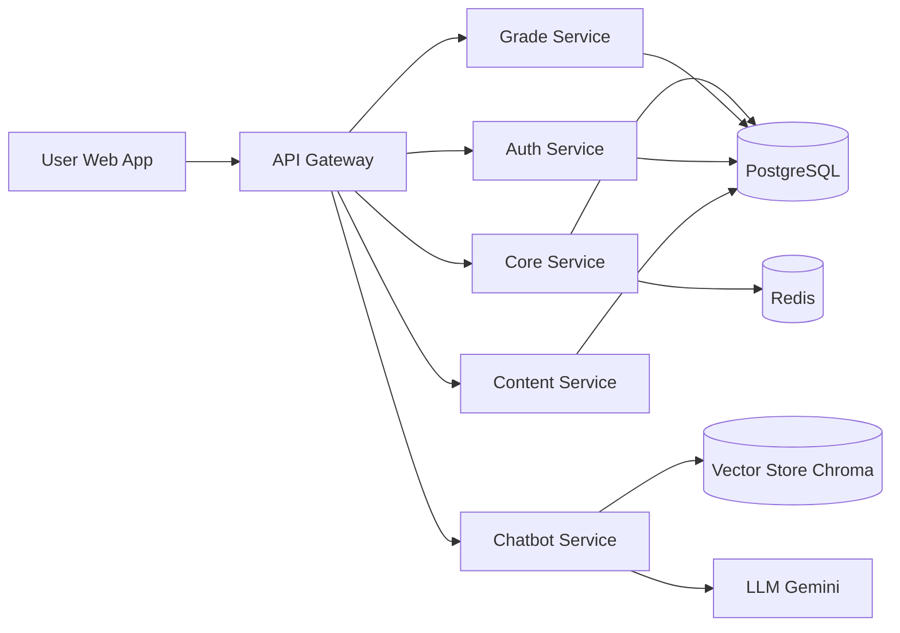

# Thiet Ke He Thong Tong The - Career Guidance & University Recommendation Platform

## 1. Muc tieu san pham
- Ho tro hoc sinh THPT tim nganh hoc, nghe nghiep, truong dai hoc phu hop.
- Ket hop 3 nguon thong tin: tinh cach + nang luc hoc tap + du lieu thi truong.
- Dua ra khuyen nghi co giai thich minh bach, khong chi tra ve danh sach.

## 2. Pham vi chuc nang day du (MVP+)
### 2.1 Tai khoan va ho so
- Dang ky, dang nhap, dang xuat.
- Ho so nguoi hoc: lop, khu vuc, to hop mon, so thich, muc tieu nghe nghiep.
- Vai tro: student, parent, counselor, admin.

### 2.2 Danh gia ban than
- Bai quiz tinh cach (Holland + Big Five rut gon).
- Bai quiz dinh huong mon hoc va phong cach hoc tap.
- Tong hop diem so hoc tap (nhap tay + OCR bang diem).

### 2.3 De xuat nghe nghiep va truong
- Danh sach nghe nghiep phu hop theo score tong hop.
- Giai thich vi sao phu hop/khong phu hop (trait, diem mon, xu huong viec lam).
- Map tu nghe nghiep sang nganh hoc va truong dai hoc.
- Bo loc: hoc phi, thanh pho, diem dau vao, loai truong, hoc bong.

### 2.4 Chatbot huong nghiep (RAG)
- Hoi dap hoi thoai tu nhien bang tieng Viet.
- Co kha nang trich xuat context tu dataset nghe nghiep.
- Co che fallback khi thieu du lieu (xin phep nguoi dung hoi tiep).
- Luu lich su chat theo user.

### 2.5 Dashboard tien trinh
- Muc do hoan thanh profile.
- Tien trinh lam quiz, cap nhat diem, xem de xuat.
- Muc tieu ngan han va nhac lich hanh dong.

### 2.6 Quan tri noi dung
- CRUD du lieu nghe nghiep, truong, nganh.
- Quan ly cac bo quiz.
- Quan ly nguon du lieu benchmark (diem chuan, hoc phi, viec lam).

## 3. Kien truc tong the de xuat
He thong hien tai da tach microservices. De hoan thien, de xuat cau truc sau:

- Frontend: React + Vite + Tailwind (BFF hoac goi truc tiep API Gateway).
- API Gateway: route, auth check, rate limit, request tracing.
- Auth Service: JWT, refresh token, RBAC.
- Core Service: quiz, recommendation engine, profile scoring.
- Grade Service: OCR pipeline + normalize diem.
- Chatbot Service: RAG retrieval + LLM response.
- Content Service (moi): quan ly truong/nganh/nghe nghiep.
- Notification Service (moi): email/nhac lich.
- PostgreSQL: du lieu nghiep vu.
- Redis: cache session, cache recommendation, queue nhe.
- Object Storage (MinIO/S3): anh, file bang diem OCR.

### 3.1 So do luong chinh

## 4. Thiet ke du lieu (PostgreSQL)
### 4.1 Bang cot loi
- users(id, email, password_hash, role, created_at, updated_at)
- student_profiles(id, user_id, grade_level, city, target_budget, target_major_group, created_at)
- quiz_templates(id, name, version, type, is_active)
- quiz_questions(id, template_id, content, options_json, weight)
- quiz_attempts(id, user_id, template_id, started_at, submitted_at, score_json)
- grades(id, user_id, school_year, semester, subject, score)
- career_catalog(id, code, name, domain, description, trait_vector_json)
- university_catalog(id, code, name, city, tuition_range, admission_score, scholarship_info)
- recommendation_results(id, user_id, version, result_json, explain_json, created_at)
- chat_sessions(id, user_id, title, created_at)
- chat_messages(id, session_id, role, content, metadata_json, created_at)

### 4.2 Nguyen tac du lieu
- Soft delete cho bang danh muc.
- Them truong version de truy vet model scoring.
- Tao index cho user_id, created_at, domain, city.

## 5. API contract de xuat (v1)
### 5.1 Auth Service
- POST /v1/auth/register
- POST /v1/auth/login
- POST /v1/auth/refresh
- POST /v1/auth/logout
- GET /v1/auth/me

### 5.2 Core Service
- GET /v1/quiz/templates
- GET /v1/quiz/templates/{id}
- POST /v1/quiz/attempts
- GET /v1/recommendations/latest
- POST /v1/recommendations/recompute
- GET /v1/careers/{id}

### 5.3 Grade Service
- POST /v1/grades/upload-transcript
- POST /v1/grades/manual
- GET /v1/grades/latest

### 5.4 Chatbot Service
- POST /v1/chat/sessions
- GET /v1/chat/sessions/{id}/messages
- POST /v1/chat/sessions/{id}/messages

### 5.5 Content Service (moi)
- GET /v1/catalog/careers
- GET /v1/catalog/universities
- POST /v1/admin/catalog/careers
- POST /v1/admin/catalog/universities

## 6. Recommendation Engine (giai thich duoc)
Score tong hop de xuat:

$$Score = 0.40 * PersonalityFit + 0.35 * AcademicFit + 0.25 * MarketFit$$

- PersonalityFit: khoang cach vector trait user va trait nghe nghiep.
- AcademicFit: do phu hop giua diem mon va competency cua nganh/nghe.
- MarketFit: xu huong nhu cau, muc luong, toc do tang truong.

Tra ve ket qua gom:
- top_careers
- top_universities
- why_recommended (3-5 ly do)
- risk_flags (neu co)
- next_actions (goi y hanh dong)

## 7. Bao mat va tuan thu
- JWT access token ngan han + refresh token rotating.
- Ma hoa password bang Argon2/Bcrypt.
- Rate limiting tai Gateway va endpoint chat.
- Kiem tra file upload OCR (mime type, scan virus, gioi han dung luong).
- Anonymize du lieu nhay cam phuc vu analytics.
- Audit log cho hanh dong admin.
- Chinh sach luu tru theo PDPA/GDPR: consent, data export, xoa du lieu.

## 8. Observability va van hanh
- Structured logging (JSON) cho tat ca services.
- OpenTelemetry tracing xuyen service.
- Metrics: latency, error rate, token usage, recommendation CTR.
- Dashboard Grafana + alert Slack/Email.
- Health checks:
  - /health/live
  - /health/ready

## 9. CI/CD va moi truong
- Moi truong: local, staging, production.
- Pipeline:
  1. Lint + unit test.
  2. Build docker images.
  3. Security scan dependencies.
  4. Deploy staging (manual approval).
  5. Smoke test API.
  6. Deploy production (blue-green/canary).

## 10. Ke hoach trien khai theo giai doan
### Giai doan 1 (2-3 tuan) - Chuan hoa backend cot loi
- Chuan endpoint theo /v1.
- Them JWT that cho auth-service.
- Luu du lieu quiz, grades, recommendation vao DB.

### Giai doan 2 (2-3 tuan) - Recommendation + Explainability
- Hoan thien scoring engine.
- Them explain_json va trang ket qua chi tiet.
- Them cache Redis cho recommendation.

### Giai doan 3 (2 tuan) - Chatbot san xuat
- Luu sessions/messages.
- Prompt guardrails + fallback.
- Them quota/rate limit chatbot.

### Giai doan 4 (2 tuan) - Noi dung va admin
- Xay Content Service.
- Trang admin CRUD danh muc.
- Import du lieu truong/nganh batch.

### Giai doan 5 (1-2 tuan) - Hardening
- Monitoring, alerting, backup/restore.
- Pen-test co ban, load test.
- Hoan thien tai lieu van hanh.

## 11. Danh sach uu tien ngay lap tuc cho repo hien tai
1. Refactor chatbot-service/main.py dang bi lap code va khai bao app 2 lan.
2. Bo sung migration PostgreSQL (Alembic) cho cac bang cot loi.
3. Chuyen login mock sang JWT + luu user.
4. Dong bo base URL frontend bang env cho tat ca services.
5. Them test API toi thieu cho auth/core/chatbot.

## 12. Definition of Done cho ban v1
- User dang ky/dang nhap thanh cong bang JWT.
- Hoan thanh quiz + nhap diem + nhan top 5 nghe nghiep co giai thich.
- Co the chat tiep noi va luu lich su chat.
- Admin cap nhat du lieu nghe nghiep/truong.
- Co dashboard metrics va canh bao loi co ban.
